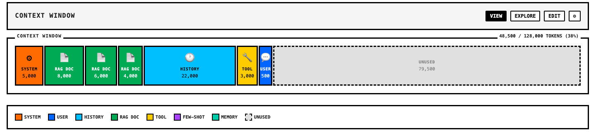
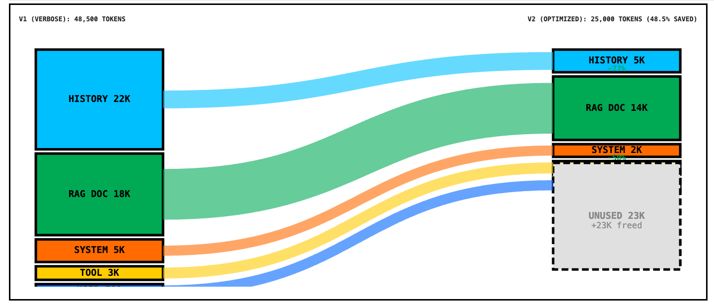

# Context Engineering

[](https://pypi.org/project/context-engineering-dashboard/)
[](https://opensource.org/licenses/MIT)

View, explore, and edit LLM context windows in Jupyter notebooks. 



Generate diff across multiple traces. 



---

## Features

- **Proportional visualization**: Component sizes reflect token usage
- **Intuitive gestures**: Hover for tooltip, click for details, double-click to edit
- **Chroma-native**: See retrieval scores, metadata, and selection decisions
- **Diff view**: Sankey diagrams show before/after compaction

---

## Installation

```bash
pip install git+https://github.com/cp71-dlai/context-engineering-dashboard.git@v0.2.0
```

With provider support:

```bash
pip install 'context-engineering-dashboard[openai]'
pip install 'context-engineering-dashboard[chroma]'
pip install 'context-engineering-dashboard[langchain]'
pip install 'context-engineering-dashboard[litellm]'
pip install 'context-engineering-dashboard[all]'
```

---

## Quickstart

### Basic Usage

```python
from context_engineering_dashboard import ContextBuilder, trace_openai
from openai import OpenAI

client = OpenAI()

# Capture a trace
with trace_openai() as tracer:
    response = client.chat.completions.create(
        model="gpt-4o",
        messages=[
            {"role": "system", "content": "You are a helpful assistant."},
            {"role": "user", "content": "Explain context engineering."}
        ]
    )

# Visualize
ctx = ContextBuilder(trace=tracer.result, context_limit=128_000)
ctx.display()
```

### With LiteLLM

```python
from context_engineering_dashboard import ContextBuilder, trace_litellm
import litellm

# Trace any LLM provider via LiteLLM (OpenAI, Claude, Gemini, etc.)
with trace_litellm() as tracer:
    response = litellm.completion(
        model="gpt-4o",
        messages=[
            {"role": "system", "content": "You are a helpful assistant."},
            {"role": "user", "content": "Explain context engineering."}
        ]
    )

# Visualize
ctx = ContextBuilder(trace=tracer.result, context_limit=128_000)
ctx.display()
```

### With Chroma RAG

```python
from context_engineering_dashboard import ContextBuilder, trace_chroma
import chromadb

client = chromadb.Client()
collection = client.get_collection("docs")

# Wrap collection for tracing
traced = trace_chroma(collection)
results = traced.query(query_texts=["How does embedding work?"], n_results=10)

# Build context and visualize
ctx = ContextBuilder(
    trace=traced.get_trace(),
    context_limit=128_000,
    show_available_pool=True
)
ctx.display()
```

### Compare Before/After

```python
from context_engineering_dashboard import ContextDiff

diff = ContextDiff(
    before=original_trace,
    after=compacted_trace,
    before_label="Original",
    after_label="After /compact"
)
diff.sankey()
```

---

## Interactions

| Gesture | Action |
|---------|--------|
| **Hover** | Tooltip with component type and token count |
| **Click** | Modal with full content and metadata |
| **Click text in modal** | Switch to edit mode (Save button appears) |
| **Click unused space** | Collapse/expand to focus on filled components |

---

## Chroma Integration

The dashboard provides special handling for Chroma collections via **ContextResource**:

**Score badges**: Visible on each RAG document component

**Click any document** to see:
- Full document text
- Similarity score
- Metadata table
- Collection name

**Available Pool**: See all retrieved documents and drag-drop to select

```python
from context_engineering_dashboard import ContextResource, ResourceType

# Wrap your Chroma collection
rag_docs = ContextResource.from_chroma(collection, ResourceType.RAG, "Docs")

# Query and select results
rag_docs.query(query_texts=["How do I..."], n_results=10)
rag_docs.select(["doc_1", "doc_2", "doc_3"])

# Visualize with Available panel
ctx = ContextBuilder(resources=[rag_docs])
```

---

## Configuration

```python
ctx = ContextBuilder(
    trace=trace,
    context_limit=128_000,      # Model's max context
    resources=[rag_docs],       # ContextResource pools to show in Available panel
)
```

---

## Serialization

```python
# Export trace
trace.to_json("my_trace.json")

# Import trace
from context_engineering_dashboard import ContextTrace
trace = ContextTrace.from_json("my_trace.json")
```

---

## Color Reference

| Component | Color | Hex |
|-----------|-------|-----|
| System Prompt | Orange | `#FF6B00` |
| User Message | Blue | `#0066FF` |
| Chat History | Light Blue | `#00BFFF` |
| RAG | Green | `#00AA55` |
| Tool | Yellow | `#FFCC00` |
| Example | Purple | `#AA44FF` |
| Scratchpad | Teal | `#00CCAA` |
| Unused | Grey (dashed) | `#E0E0E0` |

---

## API Reference

### Tracers

```python
from context_engineering_dashboard import trace_openai, trace_langchain, trace_chroma, trace_litellm

# OpenAI
with trace_openai() as t:
    ...
trace = t.result

# LiteLLM (any provider)
with trace_litellm() as t:
    ...
trace = t.result

# LangChain
with trace_langchain() as t:
    ...
trace = t.result

# Chroma
traced_collection = trace_chroma(collection)
results = traced_collection.query(...)
trace = traced_collection.get_trace()
```

### ContextBuilder

```python
ContextBuilder(
    trace: ContextTrace,
    context_limit: int,
    layout: str = "horizontal",
    show_patterns: bool = False,
    show_available_pool: bool = True,
)

# Methods
.display()                    # Render in notebook
.to_html()                    # Get raw HTML string
```

### ContextDiff

```python
ContextDiff(
    before: ContextTrace,
    after: ContextTrace,
    before_label: str = "Before",
    after_label: str = "After",
)

# Methods
.sankey()                     # Render Sankey diagram
.summary()                    # Print token savings
```

---

## Requirements

- Python 3.10+
- IPython 8.0+
- tiktoken 0.5+

Optional:
- openai (for OpenAI tracing)
- litellm (for LiteLLM multi-provider tracing)
- chromadb (for Chroma tracing)
- langchain (for LangChain tracing)

---

## Contributing

```bash
git clone https://github.com/chroma-core/context-engineering-dashboard
cd context-engineering-dashboard
pip install -e '.[dev]'
pytest
```

